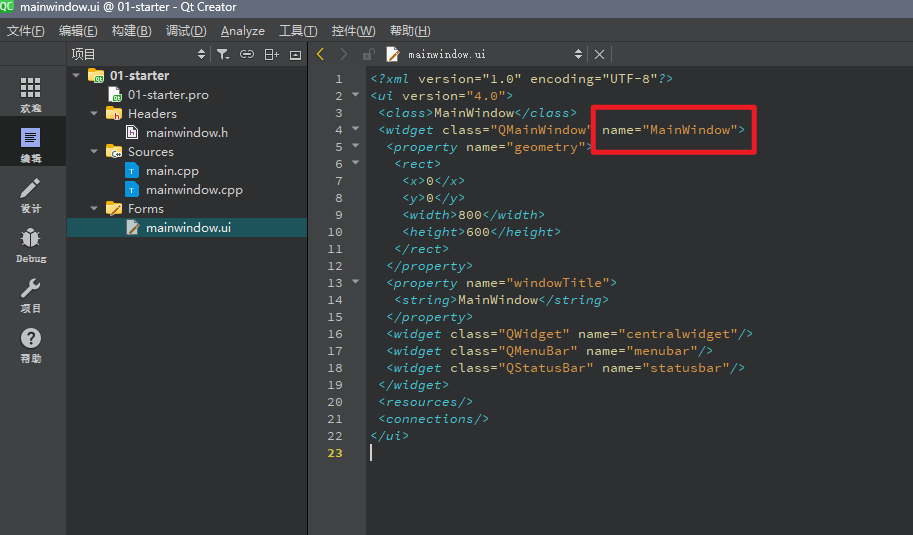

# QT

* 跨平台图形界面引擎
  * 跨平台
  * 接口简单，文档丰富
  * 内存回收优化


# 项目文件说明


## **.pro**

```
// 项目模块
QT       += core gui

// qt 版本大于 4 时添加 widget 模块
greaterThan(QT_MAJOR_VERSION, 4): QT += widgets

// 使用的 cpp 版本
CONFIG += c++11

# The following define makes your compiler emit warnings if you use
# any Qt feature that has been marked deprecated (the exact warnings
# depend on your compiler). Please consult the documentation of the
# deprecated API in order to know how to port your code away from it.
DEFINES += QT_DEPRECATED_WARNINGS

# You can also make your code fail to compile if it uses deprecated APIs.
# In order to do so, uncomment the following line.
# You can also select to disable deprecated APIs only up to a certain version of Qt.
#DEFINES += QT_DISABLE_DEPRECATED_BEFORE=0x060000    # disables all the APIs deprecated before Qt 6.0.0

// 源代码	
SOURCES += \
    main.cpp \
    mainwindow.cpp

// 头文件
HEADERS += \
    mainwindow.h

// ui 界面
FORMS += \
    mainwindow.ui

# Default rules for deployment.
qnx: target.path = /tmp/$${TARGET}/bin
else: unix:!android: target.path = /opt/$${TARGET}/bin
!isEmpty(target.path): INSTALLS += target

```


## .h

**`mainwindow.h`**

```cpp
#ifndef MAINWINDOW_H
#define MAINWINDOW_H

#include <QMainWindow>

// .ui 文件占位命名空间
QT_BEGIN_NAMESPACE
namespace Ui { class MainWindow; }
QT_END_NAMESPACE

// 继承 MainWindow -> QMainWindow -> QWidget
class MainWindow : public QMainWindow
{
    // qt object 宏定义
    // 私有信号和槽
    Q_OBJECT

public:
    // parent: 父窗口
    MainWindow(QWidget *parent = nullptr);
    ~MainWindow();

private:
    // .ui 界面指针
    Ui::MainWindow *ui;
};
#endif // MAINWINDOW_H

```


**`ui_mainwindow.h`**

```
/********************************************************************************
** Form generated from reading UI file 'mainwindow.ui'
**
** Created by: Qt User Interface Compiler version 5.14.2
**
** WARNING! All changes made in this file will be lost when recompiling UI file!
********************************************************************************/

#ifndef UI_MAINWINDOW_H
#define UI_MAINWINDOW_H

#include <QtCore/QVariant>
#include <QtWidgets/QApplication>
#include <QtWidgets/QMainWindow>
#include <QtWidgets/QMenuBar>
#include <QtWidgets/QStatusBar>
#include <QtWidgets/QWidget>

QT_BEGIN_NAMESPACE

class Ui_MainWindow
{
public:
    QWidget *centralwidget;
    // 菜单栏
    QMenuBar *menubar;
    // 状态栏
    QStatusBar *statusbar;

    void setupUi(QMainWindow *MainWindow)
    {
        if (MainWindow->objectName().isEmpty())
            MainWindow->setObjectName(QString::fromUtf8("MainWindow"));
        // 初始化主窗口大小
        MainWindow->resize(800, 600);
        // 初始化主 widget
        centralwidget = new QWidget(MainWindow);
        centralwidget->setObjectName(QString::fromUtf8("centralwidget"));
        MainWindow->setCentralWidget(centralwidget);
        // 初始化菜单栏
        menubar = new QMenuBar(MainWindow);
        menubar->setObjectName(QString::fromUtf8("menubar"));
        MainWindow->setMenuBar(menubar);
        // 初始化状态栏
        statusbar = new QStatusBar(MainWindow);
        statusbar->setObjectName(QString::fromUtf8("statusbar"));
        MainWindow->setStatusBar(statusbar);

        retranslateUi(MainWindow);

        QMetaObject::connectSlotsByName(MainWindow);
    } // setupUi

    void retranslateUi(QMainWindow *MainWindow)
    {
        MainWindow->setWindowTitle(QCoreApplication::translate("MainWindow", "MainWindow", nullptr));
    } // retranslateUi

};

// MainWindow 的类外实现
namespace Ui {
    class MainWindow: public Ui_MainWindow {};
} // namespace Ui

QT_END_NAMESPACE

#endif // UI_MAINWINDOW_H

```

## **.cpp**

**`main.cpp`** 程序主入口

```cpp
// 包含主窗口
#include "mainwindow.h"

// QT 库依赖
#include <QApplication>

int main(int argc, char *argv[])
{
	// 创建 qt app
    QApplication a(argc, argv);
	// 创建主窗口
    MainWindow w;
	// 显示主窗口
    w.show();
    // 执行 qt app 循环阻塞程序
    return a.exec();
}

```


**`mainwindows.cpp`** 主窗口

```cpp
#include "mainwindow.h"
#include "ui_mainwindow.h"

MainWindow::MainWindow(QWidget *parent)
    : QMainWindow(parent)
    , ui(new Ui::MainWindow)
{
	// 装载操作类
    ui->setupUi(this);
}

MainWindow::~MainWindow()
{
    delete ui;
}


```


## .ui

**`mainwindow.ui`**

```xml
<?xml version="1.0" encoding="UTF-8"?>
<ui version="4.0">
 <class>MainWindow</class>
<!-- class: 界面类型 name: 界面控制类 -->
 <widget class="QMainWindow" name="MainWindow">
  <property name="geometry">
   <rect>
    <x>0</x>
    <y>0</y>
    <width>800</width>
    <height>600</height>
   </rect>
  </property>
  <property name="windowTitle">
   <string>MainWindow</string>
  </property>
  <widget class="QWidget" name="centralwidget"/>
  <widget class="QMenuBar" name="menubar">
   <property name="geometry">
    <rect>
     <x>0</x>
     <y>0</y>
     <width>800</width>
     <height>22</height>
    </rect>
   </property>
  </widget>
  <widget class="QStatusBar" name="statusbar"/>
 </widget>
 <resources/>
 <connections/>
</ui>

```


# 对象模型（对象树）

QT中所有的 qt 对象都继承了一个父类 QObject


## 对象树销毁顺序

QObject 在堆区创建的子类对象，会自动被析构释放

```cpp

MainWindow::~MainWindow()
{    
    qDebug("MainWindow delete");
}

MyButton::~MyButton()
{
    qDebug("MyButton delete");
}

MyButton2::~MyButton2()
{
    qDebug("MyButton2 delete");
}

MainWindow::MainWindow(QWidget *parent)
    : QMainWindow(parent)
{
   
    MyButton* btn1 = new MyButton(this);
}

MyButton::MyButton(QWidget *parent) :
    QPushButton(parent)
{
    MyButton2 *btn = new MyButton2(this);
}

MyButton2::MyButton2(QWidget *parent) :
    QPushButton(parent)
{
}

int main(int argc, char *argv[])
{
    QApplication a(argc, argv);
    MainWindow w;
    w.show();
    return a.exec();
}
```

以上为一段 QT 对象树关系实例代码，继承关系为：`MainWindow -> MyButton -> MyButton2`。其中，`MainWindow` 是在 `main` 中创建在栈中, `MyButton` 和 `MyButton2` 是在堆中， `MainWindow` 会自动在作用域超出后销毁，`MyButton` 和 `MyButton2` 是在堆中创建，由 `QObject` 销毁。


在 `MainWindow` 的析构执行后，会调用其父类的析构函数，当调用到 `QObject` 的析构时，才会开始对 `MainWindow` 的子对象 `MyButton` 进行销毁；

而 `MyButton` 与其同理，当自身的析构函数执行完毕后，紧接着程序开始执行其父类的析构函数，到 `QObject` 的析构时，又开始对 `MyButton` 的子对象 `MyButton2` 进行析构；

当 `MyButton2` 也完成一套 QT 析构流程后，`MyButton` 的子对象才算完全析构完成，接着就是 `MainWindow` 的子对象完全析构完成;

所以，QT 中的对象树析构顺序是在 `QObject` 中进行排序的，而非程序调用析构函数为顺序。

`~MainWindow -> MainWindow 父对象 QObject 析构流程 -> ~MyButton -> MyButton 父对象 QObject 析构流程 -> ~MyButton2 -> MyButton2 父对象 QObject 析构流程 -> MyButton 父对象 QObject 析构流程 -> MainWindow 父对象 QObject 析构流程`;

通过对象的析构函数触发 `QObject` 对象树的析构流程

---


# QT如何将ui和代码关联


在 `.ui` 中定义了该 `widge` 类名为 `MainWindow`




在编译时，会根据该 `.ui` 文件生成一个头文件:

```cpp
/********************************************************************************
** Form generated from reading UI file 'mainwindow.ui'
**
** Created by: Qt User Interface Compiler version 5.14.2
**
** WARNING! All changes made in this file will be lost when recompiling UI file!
********************************************************************************/

...
    
QT_BEGIN_NAMESPACE

class Ui_MainWindow
{
public:
 	...
        
    void setupUi(QMainWindow *MainWindow)
    {
      ...
    } // setupUi

    void retranslateUi(QMainWindow *MainWindow)
    {
        MainWindow->setWindowTitle(QCoreApplication::translate("MainWindow", "MainWindow", nullptr));
    } // retranslateUi

};

namespace Ui {
    class MainWindow: public Ui_MainWindow {};
} // namespace Ui

QT_END_NAMESPACE

#endif // UI_MAINWINDOW_H

```


在该头文件中定义了一个类 `Ui_MainWindow`，并在命名空间 `Ui` 内声明了一个类 `MainWindow` 继承了他

而在用户代码 `mainwindow.h`中，通过一个指针引入该命名看见中的类，从而间接使得指针指向了 `Ui_MainWindow` 并通过该指针操作该 `widget`

```cpp
#ifndef MAINWINDOW_H
#define MAINWINDOW_H

#include <QMainWindow>

QT_BEGIN_NAMESPACE
namespace Ui { class MainWindow; }
QT_END_NAMESPACE

class MainWindow : public QMainWindow
{
    Q_OBJECT

public:
    MainWindow(QWidget *parent = nullptr);
    ~MainWindow();

private:
    Ui::MainWindow *ui; // 指向窗口
};
#endif // MAINWINDOW_H

```

---


# QT的窗口类

##  Qt三大窗口类

* QWidget
* QMainWindow
* QDialog


## QWidget

* 所有窗口类的基类

* 可以内嵌入其它窗口中
* 可以作为独立窗口
* Qt 中所有空间的基类

### 自定义 widget

```cpp
#ifndef TESTWIDGET_H
#define TESTWIDGET_H

#include <QWidget>

namespace Ui {
class TestWidget;
}

class TestWidget : public QWidget
{
    Q_OBJECT

public:
    explicit TestWidget(QWidget *parent = nullptr);
    ~TestWidget();

private:
    Ui::TestWidget *ui;
};

#endif // TESTWIDGET_H

```

```cpp
#include "testwidget.h"
#include "ui_testwidget.h"

TestWidget::TestWidget(QWidget *parent) :
    QWidget(parent),
    ui(new Ui::TestWidget)
{
    ui->setupUi(this);
}

TestWidget::~TestWidget()
{
    delete ui;
}

```


在主窗口中使用

```cpp
#include "mainwindow.h"
#include "ui_mainwindow.h"

#include "testwidget.h"

MainWindow::MainWindow(QWidget *parent)
    : QMainWindow(parent)
    , ui(new Ui::MainWindow)
{
    ui->setupUi(this);

    // 初始化 widget (无父窗口)
    TestWidget* twidget1 = new TestWidget;
    twidget->show();

    // 初始化 widget (有父窗口)
    // this = MainWindow*
    TestWidget* twidget2 = new TestWidget(this);
}

MainWindow::~MainWindow()
{
    delete ui;
}


```


## QDialog

* 对话框窗口类
* 模态和非模态两种显示方式
* 不能内嵌


dialog 设置父窗口后，将会与该父窗口关联，并保持在其上层显示


当父窗口被关闭时，dialog 也会关闭

## QMainWindow

* 主窗口类
* 可以包含菜单栏，工具栏，状态栏
* 不能内嵌


# Qt 位置坐标体系

Qt 的坐标原点为窗口的左上角

嵌套关系的窗口中，子窗口以父窗口左上角为坐标原点


# 信号和槽

信号：事件

槽：处理事件触发

`connect(信号发送者, 发送的信号, 信号接受者, 信号处理函数)`

`disconnect(信号发送者, 发送的信号, 信号接受者, 信号处理函数)`

信号可以连接信号，

`connect(信号发送者, 信号1, 信号接受者, 信号2)`

这时触发为：信号1 -> 信号2 -> 信号2连接的槽

`connect(btn1, &MyButton::clicked, this, &MainWindow::close);`


当信号和槽有参数时，信号的参数签名需要与槽的参数签名一致

信号的参数签名 >= 槽的参数签名

## 自定义信号和槽

`treacher.h`

```cp
#ifndef TEACHER_H
#define TEACHER_H

#include <QObject>

class Teacher : public QObject
{
    Q_OBJECT
public:
    explicit Teacher(QObject *parent = nullptr);

signals:
    // 声明自定义信号 不用实现
    void finshCourse();
	// 重载
    void finshCourse(QString str);

};

#endif // TEACHER_H
```


`student.h`

```
#ifndef STUDENT_H
#define STUDENT_H

#include <QObject>

class Student : public QObject
{
    Q_OBJECT
public:
    explicit Student(QObject *parent = nullptr);

signals:

public slots:
    // 声明槽函数 需要实现
    void go();
    // 重载
    void go(QString);
};


#endif // STUDENT_H

```


`student.cpp`

```
#include "student.h"
#include <QDebug>

Student::Student(QObject *parent) : QObject(parent)
{

}

void Student::go()
{
    qDebug("吃饭!");
}

void Student::go(QString str)
{
    qDebug() << "去 " << str << " !";
}

```


绑定信号，触发槽函数实例

```cpp
#include "mywidget.h"
#include "student.h"
#include "teacher.h"
#include "ui_mywidget.h"

MyWidget::MyWidget(QWidget *parent)
    : QWidget(parent)
    , ui(new Ui::MyWidget)
{
    ui->setupUi(this);

    this->t = new Teacher(this);

    this->stu = new Student(this);

    // 绑定信号与槽
    // connect(t, &Teacher::finshCourse, stu, &Student::go);

    void(Teacher::*tSignal1)(void) = &Teacher::finshCourse;
    void(Student::*sSignal1)(void) = &Student::go;
    connect(t, tSignal1, stu, sSignal1);
    // 发送信号 触发 go()
     emit t->finshCourse();

    // 绑定重载函数
    // 使用函数指针指向重载函数
    void(Teacher::*tSignal2)(QString) = &Teacher::finshCourse;
    void(Student::*sSignal2)(QString) = &Student::go;
    connect(t, tSignal2, stu, sSignal2);
    emit t->finshCourse("宿舍");
}

MyWidget::~MyWidget()
{
    delete ui;
}


```


# QtSource

QT 中的资源管理

添加文件`res.qrc`

```xml
<RCC>
    <qresource prefix="资源自定义前缀">
        <file>资源路径</file>
    </qresource>
</RCC>
```


使用：

```cpp
// 添加图片
ui->action1->setIcon(QIcon(":img/res/image.png"));
ui->pushButton->setIcon(QIcon(":img/res/image.png"));
```


# QtDialog

模态: `QtDialog.exe();` 弹出后阻塞进程

非模态: `QtDialog.show();` 弹出后不阻塞进程

```cpp
QPushButton* btn = new QPushButton("click", this);
QPushButton* btn2 = new QPushButton("click", this);
btn2->move(btn->x() + btn->width(), btn->y());

QDialog* log1 = new QDialog(this);

// 模态 - 阻塞
connect(btn, &QPushButton::clicked, log1, &QDialog::exec);
// 非模态 - 不阻塞
connect(btn2, &QPushButton::clicked, log1, &QDialog::show);
```


## QMessageBox

提示对话框

```cpp
// 错误
QMessageBox::critical(this, "错误", "错误");
// 信息
QMessageBox::information(this, "信息", "消息");
// 提问 返回点击的按钮
QMessageBox::StandardButton clickBtn = QMessageBox::question(this, "你好", "选择",
                                                             QMessageBox::StandardButton::Save |
                                                             QMessageBox::StandardButton::Ok | QMessageBox::Cancel);
if (clickBtn == QMessageBox::Save)
{
    qDebug("点击 save");
}
else if (clickBtn == QMessageBox::Cancel)
{
    qDebug("点击 cancel");
}
else if (clickBtn == QMessageBox::Ok)
{
    qDebug("点击 ok");
}

// 警告
QMessageBox::warning(this, "警告", "warn");
```


## QColorDialog

```cpp
// 颜色对话框
QColor color = QColorDialo g::getColor();
qDebug() << "color " << color;
```


## QFileDialog

```cpp
QPushButton* btn = new QPushButton(this);

// 文件对话框
QString filename = QFileDialog::getOpenFileName(this, "选择文件", "D:/", "(*.png )");
qDebug() << "file name " << filename;
btn->setIcon(QIcon(filename));
btn->show();
```


